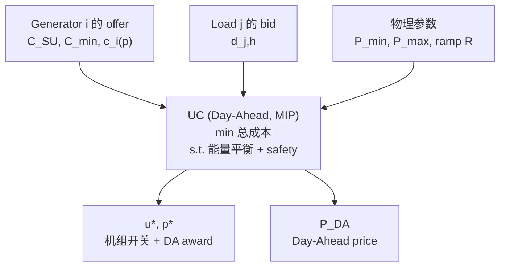
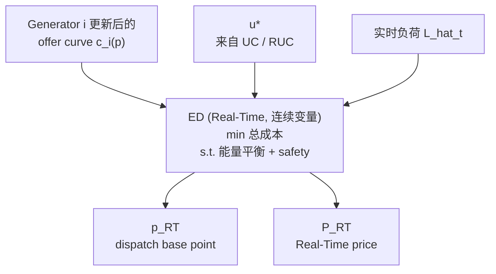

电力市场是一个非常有趣的市场。和大部分商品市场不同，它有两个很特别的特点：

<!--more-->

1. **实时的供需平衡（real-time supply-demand balance）**：电力几乎无法大规模低成本存储，必须通过 transmission network 实时传输。一旦某一时刻供给和需求不匹配，系统的频率、电压就会出问题，严重时会导致大面积停电——所以电力系统必须在**每一个时刻**都维持供需平衡。
2. **供给和需求的随机性，以及供给的"不及时"**：供给侧，bulk generation（比如中国大量的煤电厂、美国大量的天然气发电厂）启动过程慢、成本高——一台机组从冷启动到能稳定出力，往往需要几个小时，而且每次启停都有实打实的成本。与此同时，wind and solar 这类可再生能源虽然几乎没有启动成本，但输出高度依赖天气，具有很大的不确定性。需求侧同样是随机的：无论是大型商业用电还是居民用电，都无法被精确预测（我们普通用户也不会提前计划好某个灯泡什么时候打开）。

这两个特点合在一起，催生了电力市场非常独特的设计——**Day-Ahead (DA)** 和 **Real-Time (RT)** 两级市场结构。而正是因为这个结构本身存在"预测 → 修正"的时间差，才进一步催生了 **virtual trading** 这样一个在其他商品市场里都很少见的机制。这篇笔记会按照这个逻辑，把这几件事串起来讲清楚。

---

## 1. 谁在管理和参与市场？

在美国，电力批发市场一般由 **ISO（Independent System Operator）**或 **RTO（Regional Transmission Organization）**管理——它们是非营利、独立于发电商和电力公司的运营主体，负责保证电网安全运行，同时运营 DA 和 RT 市场来完成经济调度。美国主要的 ISO/RTO 包括 PJM、MISO、CAISO、ISO-NE、NYISO、SPP，以及这篇笔记会重点举例的 **ERCOT（Electric Reliability Council of Texas）**，它管理着德州约 90% 的电网。

ERCOT 官网：[https://www.ercot.com](https://www.ercot.com)，上面公开了 DAM、RTM 的市场数据和规则文档，是核实这类细节非常好的一手资料来源。

### 市场里的参与方

粗颗粒地说，市场里大致有三方：**generation**、**load**、以及 **virtual trader**。Generation 和 load 具体要做什么，会在第 2、3 节展开；virtual trader 的具体行为放到第 5 节 "What is Virtual Trading" 详细展开。这里先提一句要注意的地方：**不是每个 ISO 都允许 virtual trader 这种纯金融参与方**——第 5 节会具体说明，这一点在 ERCOT 语境下尤其重要。Generation 和 load 这两方的角色，在几乎所有 ISO 里则是一致的。

---

## 2. 什么是 Day-Ahead 和 Real-Time Market？（直觉篇）

如开头所说，电力通过 transmission network 传输，而系统安全运行依赖于每时每刻的供需平衡。要理解为什么需要两个市场，得先看供给和需求两侧各自的特点：

**供给侧**主要包含两类发电单位：
- **Bulk generation**：传统大型机组（煤电、天然气、核电等），启动慢、成本高，需要提前规划。
- **Wind / solar**：边际成本接近零，但输出高度随机，很大程度取决于天气预报的准确性。

**需求侧**主要是大型商业用电和居民用电，两者都带有随机性——没有人会精确计划"我几点打开这盏灯"。

考虑某一天，记为 $D$。那么 $D\text{-}1$ 就是 $D$ 的前一天。

**Bulk generation 的慢启动特性**直接 motivate 了一个 **DA market**：这个市场在 $D\text{-}1$ 运行，目的是提前一天大致确定 $D$ 这一天每个小时的发电组合——也就是回答"到底该不该在某个时段开启某台机组"这个问题。直觉上，这是在解一个"给定对未来一天负荷和可再生出力的预测，怎么安排机组的开关和出力，才能让总成本最低，同时不违反任何安全约束"的优化问题，业内称为 **Unit Commitment (UC)**，本质上是一个混合整数规划（mixed-integer program，因为"开/关"是个 0/1 决策）。DA market 的清算结果，给整个系统的供需平衡打下了一个基础，保证系统真实运行时，大致能满足最基本的供需匹配，不至于完全措手不及。UC 具体的数学形式我们留到第 3 节 Deep Dive 里，结合 generation 和 load 到底提交了什么一起展开。

### 但 DA 只是一个"预测"

DA 的 dispatch 本质上是基于对未来一天的**预测**（预测负荷、预测新能源出力）做出的决策，而预测一定存在误差。这个误差没法在 $D\text{-}1$ 解决，只能靠 $D$ 当天、实时发生的 **Real-Time Market (RTM)** 来修正。RTM 在 $D$ 当天连续运行（不同市场颗粒度略有差异，例如 ERCOT 每 5 分钟做一次经济调度，15 分钟结算一次）。

直觉上，RTM 要解的是一个**经济调度（Economic Dispatch, ED）**问题：给定 UC 已经决定"开机"的机组，在每一个时刻，把这些机组的出力重新分配，用最低成本满足实际负荷，同时不违反安全约束。和 UC 不一样，这里不再有"开/关"这个整数决策——机组是否在线，已经在 UC（以及后续可能的 reliability commitment）阶段基本确定了。ED 具体的数学形式，同样留到第 3 节。

---

## 3. Day-Ahead and RT Market Deep Dive

上面解释了整体的逻辑，这一节把细节展开：generation 和 load 具体要在 DAM 和 RTM 里提交什么、这些提交如何变成 UC 和 ED 的输入、以及上一节留下的两个 program 到底长什么样。（virtual trader 我们已经在第 1 节提过，具体行为放在第 5 节；这一节先站在 generation 和 load 的角度来看。）

### Generation 在 DAM 需要提交什么？

沿用第 2 节里提到的 UC 直觉，generator $i$ 需要提交的东西，业内统称为 **offer**（报价）——这就是所谓的 **three-part offer**，一共三部分：

- $C_i^{SU}$：startup offer（\\$/次启动）
- $C_i^{min}$：minimum-energy offer（在最低出力 $\underline{P}_i$ 时的报价）
- $c_i(p)$：energy offer curve，一条分段线性的 $p$ 对 $\\$/MWh$ 曲线

这三部分，就是下面 UC 目标函数里 $C_i^{SU}, C_i^{min}, c_i(\cdot)$ 这几项真正的来源——它们不是 ISO 凭空设定的，而是 generator 自己申报的。

### Load 在 DAM 需要提交什么？

对应地，load $j$（准确地说是代表它的 LSE，通过 QSE）需要提交的东西，业内统称为 **bid**（出价）：一条 **demand bid curve** $v_j(d)$——即"愿意为第 $d$ 兆瓦支付多少钱"，和 generator 的 offer curve 是对称的角色。如果 load 接近完全 inelastic（现实中很多零售负荷确实如此），这条曲线就退化成一个固定量 $d_{j,h}$（报价贴近 price cap，确保基本一定被满足）。系统总负荷就是 $L_h=\sum_j d_{j,h}$——这就是 UC 里 $L_h$ 的真正来源。

### UC：把 offer 和 bid 变成 award 和 price



现在可以把第 2 节留下的 UC 写完整了：

$$
\min_{u_{i,h},\, p_{i,h},\, y_{i,h}} \quad \sum_{i,h} \Big[\, C_i^{SU}\cdot y_{i,h} \;+\; C_i^{min}\cdot u_{i,h} \;+\; c_i(p_{i,h}) \,\Big]
$$

$$
\text{s.t.} \quad \mathbf{1}^\top p_h = L_h \qquad \text{(能量平衡, 每个 } h\text{)}
$$

$$
\underline{P}_i\, u_{i,h} \le p_{i,h} \le \overline{P}_i\, u_{i,h}, \qquad |p_{i,h}-p_{i,h-1}|\le R_i \qquad \text{(safety / 物理约束)}
$$

$$
y_{i,h} \ge u_{i,h}-u_{i,h-1}, \qquad y_{i,h}\ge0 \qquad \text{(启动指示)}
$$

其中：
- $u_{i,h}\in\{0,1\}$：机组 $i$ 在第 $h$ 小时是否开机——这就是那个"整数"变量，UC 之所以是 MIP 正是因为它；
- $p_{i,h}\ge0$：机组 $i$ 在第 $h$ 小时的实际出力；
- $y_{i,h}$：机组 $i$ 在第 $h$ 小时是否发生了一次"启动"（从关到开）。它不需要被显式声明成整数——因为 $C_i^{SU}>0$ 且目标是 minimize，求解器自然会把 $y_{i,h}$ 压到刚好等于 $\max(0,\,u_{i,h}-u_{i,h-1})$，不会白白多付启动成本；
- $C_i^{SU},\,C_i^{min},\,c_i(\cdot)$：来自 generator 的 offer；
- $\underline{P}_i,\overline{P}_i$：机组物理出力上下限，$R_i$：爬坡限制；
- $L_h=\sum_j d_{j,h}$：来自 load 的 bid 加总。

解出这个 MIP 之后，$u^\*\_{i,h}$ 告诉你哪些机组该开，$p^\*\_{i,h}$ 就是每个机组在 DAM 拿到的 **award**，而能量平衡约束对应的 shadow price（对偶变量）$\lambda_h$，就是这一时段的 **DA price** $P^{DA}_h$。

值得强调一句：UC 这个 program 本身"不知道"任何机组的真实发电成本，也"不知道"任何负荷的真实用电价值——它只是在参与方自己申报的 $C_i^{SU}, C_i^{min}, c_i(\cdot), v_j(d)$ 上求解一个最优化问题。这也是为什么"如实报价"（truthful bidding）在这类市场设计里很重要：如果参与方谎报 offer/bid，UC 解出来的结果就不再是基于真实成本 / 真实价值的最优解。

### RTM 中，generation 和 load 分别要做什么？

- **Generation**：在每次 SCED 求解前可以**更新**它的 energy offer curve $c_i(p)$（不必和 DA 提交的一样），然后**执行** ERCOT 每 5 分钟发出的 dispatch base point $p_{i,t}^{RT}$。
- **Load**：绝大多数负荷在 RTM 里不提交任何东西——它是被动地"用多少是多少"，实际消费量 $d_{j,t}^{RT}$ 是被观测到的，不是被决定的。（只有 Load Resource / Controllable Load Resource 这类特殊、可控的大负荷才能像 generator 一样在 RTM 里主动提交 bid、接受 dispatch。）

### ED：实时把 offer 重新分配



同样，把第 2 节留下的 ED 写完整：

$$
\min_{p_{i,t}} \quad \sum_i c_i(p_{i,t})
$$

$$
\text{s.t.} \quad \mathbf{1}^\top p_t = \hat{L}_t \ \text{(实时负荷)}, \qquad \underline{P}_i\, u^*_{i,h} \le p_{i,t} \le \overline{P}_i\, u^*_{i,h}, \qquad |p_{i,t}-p_{i,t-\Delta}|\le R_i\Delta
$$

这里的 $c_i(p)$ 是 generator 在实时**更新后**的 offer curve（可能和 DA 时提交的不一样），$u^*_{i,h}$ 是 UC（以及可能的 reliability commitment）已经决定好的开关机状态，$\hat{L}_t$ 是当前时刻的实时负荷。和 UC 一样，ED 这个 program 本身也不知道任何真实成本——$c_i(p)$ 依然是 generator 自己申报的数字，只是这次可以每 5 分钟更新一次。

每次求解都给出一组新的 $p^{RT}_{i,t}$（也就是机组收到的 dispatch instruction，或叫 base point），以及对应的对偶价格——**RT price** $P^{RT}_t$。

### 一个具体的例子

假设某小时 $h$，generator A 在 DAM 拿到 $p^*_A=100$ MW 的 award，$P^{DA}_h=\\$30$/MWh。实时里因为某种原因（比如 congestion，或被要求 backdown），它实际只发了 $p^{RT}_A=80$ MW，而此时 $P^{RT}_h=\\$50$/MWh。两部分结算（two-settlement）：

$$
\text{Payment}_A = \underbrace{100\times30}_{DA} + \underbrace{(80-100)\times50}_{RT\ \text{偏差}} = 3000-1000=\$2000
$$

同一小时，假设 load B 在 DAM 买了 $d^*_B=100$ MW，$P^{DA}_h=\\$30$/MWh，但实际用了 $d^{RT}_B=110$ MW（比如一个突然很热的下午）：

$$
\text{Cost}_B = 100\times30+(110-100)\times50=3000+500=\$3500
$$

两边结算逻辑完全对称：DA 部分的钱是锁定的，RT 部分只需要为"实际值和 DA 承诺值之间的差额"按 RT price 结算。

---

## 4. Motivation: Uncertainty is Bad but Also Opportunity

上面这个例子已经能看出问题了。

**Generator A** 因为被迫少发电、又刚好撞上 RT price 上涨，多损失了 **\\$1000**（相对于"精确交付 100 MW、稳拿 \\$3000"这个基准）。**Load B** 的情况方向相反但逻辑一致：因为实际用电比预测多、又刚好撞上 RT price 上涨，多付了 **\\$500**（相对于"刚好用掉 100 MW"这个基准）。

但这个"损失"完全取决于运气的方向。反过来想：

- 如果 generator A 那个小时反而被要求**多发**到 120 MW（而不是被压到 80 MW），同样 $P^{RT}_h=\\$50$，它的偏差项就变成 $(120-100)\times50=+\\$1000$——同样一份"偏离 DA award"的不确定性，这次变成了意外之财。
- 如果 load B 那天实际只用了 90 MW（而不是 110 MW），同样 $P^{RT}_h=\\$50$，它的偏差项就变成 $(90-100)\times50=-\\$500$，也就是少付了 \\$500——相当于把用不掉的 10 MW，实时里按 \\$50 "卖"回给了市场。

也就是说：

> **Uncertainty 本身是双向的——它既可能带来损失，也可能带来意外的收益，方向完全取决于"偏差的符号"和"RT price 的方向"这两件事如何组合，而这两件事在 D-1 提交 DA 头寸的时候都是未知的。**

问题在于，generator 和 load 的主业分别是"发电"和"用电 / 服务客户"，他们并不希望被动承担这种纯粹因为预测误差而产生、方向不可控的财务波动——这是一种他们被迫承担、却并不擅长管理的风险。

但反过来想：既然 DA-RT 之间的这个价差（spread）本质上是一个关于"未来价格"的**预测问题**，那就一定存在专门擅长预测、并且愿意主动承担这种风险来换取预期收益的第三方。这正是 **virtual trader** 存在的 intuition——他们不拥有任何实体资产，只专注于预测 DA 和 RT 之间的价差，用纯金融头寸对赌这个价差，本质上是把 generator 和 load "不想要、不擅长管理"的这部分风险，转移给了一个专门为承担它而生的市场参与者。

---

## 5. What is Virtual Trading

**先澄清一件事**：并不是每个 ISO 都允许下面要讲的这种纯金融 virtual trading。NYISO、ISO-NE、PJM、MISO、CAISO 都允许，但 **ERCOT 目前不允许**——根据 Hubert, Lolas & Sircar (2026) 的说明，ERCOT 没有 INC/DEC 这种纯金融的能量虚拟交易，physical resource 自己决定要不要在 DAM self-commit，承担的是和 virtual trader 类似的 DART 风险敞口，但没有一个专门的、不持有实体资产的"纯金融交易者"身份可以直接下场做 INC/DEC。ERCOT 有的是 **PTP Obligation**——一种只押注两个节点之间 congestion 价差、而非单个节点绝对价差的金融产品，逻辑上是第 6 节讲的 INC/DEC 的一个子集（只覆盖 congestion 分量）。

下面仍然用 INC/DEC 这套语言讲清楚 virtual trading 的核心逻辑——这套机制在 NYISO、ISO-NE、PJM 等市场里是真实存在的，理解了它，再回头看 ERCOT 的 PTP Obligation，或者第 3 节提到的"generator 自己决定是否 self-commit"，会更清楚这些设计选择背后的逻辑差异。

Virtual trader 的参与方式非常干净——只在 **DAM** 提交头寸，在 **RTM 里完全不出现**：

- **INC**（相当于金融卖方）：在 DAM 里"卖出" $x^{INC}_h$ MW；
- **DEC**（相当于金融买方）：在 DAM 里"买入" $x^{DEC}_h$ MW。

两者直接进入和 generator / load **完全相同**的能量平衡约束：

$$
\sum_i p_{i,h} + x^{INC}_h = \sum_j d_{j,h} + x^{DEC}_h
$$

UC 的 optimization 根本不区分这份供给 / 需求是"真实的"还是"纯金融的"——这也是为什么它能无缝嵌入第 3 节的 UC 框架，不需要任何额外的建模。

结算规则也很简单，因为它们没有任何真实的物理交付：

$$
\text{INC profit} = (P^{DA}-P^{RT})\times Q, \qquad \text{DEC profit} = (P^{RT}-P^{DA})\times Q
$$

它们的"操作"仅仅是在 $D\text{-}1$ 的 DAM 投标窗口提交一次头寸——一旦 DAM 清算完成，整个经济结果就已经锁定，剩下的只是等待 RT price 实现。

---

## 6. 有了 Virtual Trader 之后，具体的 Benefits

回到第 4 节 generator A 和 load B 的例子——virtual trading 恰恰是在直接回应这两个具体的损失，但它发挥作用的**渠道**不太一样：一个是**系统层面**（别人交易，改变了整个节点的 DA price，你被动受益），另一个是**个体层面**（你自己主动持有一份 virtual 头寸来对冲自己的风险）。下面分别用回第 4 节的例子来说明（提醒一下：这两个例子用的是 NYISO / ISO-NE / PJM 这类允许 virtual trading 的市场逻辑，参见第 5 节的澄清）。

### 呼应 Generator A 的损失（系统层面）

如果这个节点历史上经常出现"DA 被低估、RT 容易走高"的模式（比如系统性低估了附近某风电场傍晚出力下降的概率），一群做过研究的 trader 会判断出 $P^{RT}>P^{DA}$ 的概率更高，于是主动提交 **DEC**，在 DAM 买入。这份额外需求会把 $P^{DA}_h$ 从 \\$30 推高到，比如说，\\$40（这里简化假设 award 的量不变，只是清算价格上升）。

这时候 generator A 即使还是只发了 80 MW（一样被迫 backdown），它的结算变成：

$$
100\times40+(80-100)\times50=4000-1000=\$3000
$$

正好回到了它"精确交付 100 MW"本该拿到的水平。Virtual trader 的存在，把原本"藏"在 RT 里、要等实时才会兑现的那部分 scarcity value，提前反映进了 DA price 里，间接帮 generator A 补上了那 \\$1000 的损失——而且 generator A 自己**什么都不需要做**，纯粹是价格信号变好了。

**这里还有一个值得展开的二阶效应。** DEC buying 增加了 DAM 能量平衡里的需求侧——市场要出清，这部分额外的"需求"必须由供给侧的某种变化来匹配，机制上有两种可能：

1. **Intensive margin**：已经清算的机组拿到更大的 award（反正它们本来就要发电，只是提前多卖出去一些）；
2. **Extensive margin**：更高的清算价格越过了某个机组的报价门槛，让一台原本不会清算的机组新增被 commit——$u_{i,h}$ 从 0 变成 1。

只有第二种情况才真正让新的物理容量上线。这正好呼应第 3 节 Deep Dive 里那个煤电厂的例子（DA 从 \\$30 涨到 \\$65，让一台边际成本 \\$50 的机组新清算）——如果这里发生的是 extensive margin 效应，那台新 commit 的机组在实时里也在线、可调度，而 $u^*_{i,h}$ 正是 UC 传递给 RTM 的初始承诺状态（我们在第 3 节讨论过这个物理连接）。系统里多一台在线机组，意味着真正出现 real-time scarcity 的概率和严重程度都会下降——而 scarcity 正是 RT price 出现极端尖峰的主因。

但这里有两个需要说清楚的地方：

- **这个效应只在 extensive margin 成立。** 如果新增需求只是让已经在线的机组拿到更大的 award，没有新机组被 commit，"缓解 scarcity"这个说法就不成立。
- **这不完全等于"用户买到更便宜的电"。** 注意在这个例子里，load 的 DA 锁价成本其实是**上升**的（从 \\$30/MWh 涨到 \\$40/MWh，这正是问题的关键所在）。真正发生的事情是：DA price 之前系统性地低估了背后的真实风险（风电傍晚出力下降的模式），导致本该通过 DAM 这个相对便宜、高效的渠道被 commit 的容量迟迟没有被 commit——而这笔成本迟早要被支付，只是原本会通过更昂贵、低效的方式（RUC 的 out-of-market commitment，或者 RT scarcity pricing——这些成本最终还是以 uplift 的形式转嫁给 load）来兑现。所以更准确的说法是：**不是"更便宜"，而是"更少暴露在尾部风险的价格尖峰之下，而那笔迟早要付的成本，改由更便宜的渠道来支付。**这和第 6 节引用的 Potomac Economics 在 MISO 的发现是同一套逻辑——virtual trading 让市场提前把 real-time uncertainty 的期望价值反映出来，不必等到昂贵的 RUC / scarcity pricing 机制被触发才兑现。

### 呼应 Load B 的损失（个体层面）

反过来，如果 load B（或者它背后的 LSE）自己预见到预测可能偏低（比如提前知道有热浪要来），它完全可以**主动扮演一次 virtual trader 的角色**：除了买 100 MW 的实际负荷，额外再买一份 10 MW 的 **DEC** 头寸，专门对赌"实时可能比预测的更贵"。

如果实际情况正如第 4 节所说——用了 110 MW，$P^{RT}=\\$50$——那么：

$$
\text{物理部分（不变）：}\ 100\times30+(110-100)\times50=3500
$$
$$
\text{DEC 头寸收益：}\ (50-30)\times10=\$200
$$
$$
\text{净成本：}\ 3500-200=\$3300
$$

有意思的是，$3300$ 正好等于 $110\times30$——也就是说，只要 load 能把 DEC 头寸的量精确对应上自己真实会发生的偏差量，它的最终净成本就完全等价于"用 DA price 给自己实际用掉的全部 110 MW 结算"，相当于把第 4 节里那份方向不可控的偏差风险，完全转化成了一个确定的、以 DA price 计价的账单。当然，这个效果依赖于 load 对"自己会偏差多少"这件事本身判断准确——如果猜错了偏差的大小，这份对冲就只是部分对冲，仍会留下一部分残余风险。

### 小结

Virtual trading 的核心价值，从这两个例子就能看得很清楚：它把 generator 和 load 在第 4 节里被迫承担、却无力管理的"预测误差风险"，转化成了一个可以被定价、被交易、被对冲的金融头寸——愿意承担这份风险、并且更擅长预测的第三方站到了这个价差的对面。这既通过**系统层面**的价格信号改善（DA price 更接近真实的未来 RT 价格预期）让所有人受益，也通过**个体层面**的对冲工具，让 generator 和 load 在愿意主动参与时，能精确地把自己暴露的那部分风险转移出去。

---

## 7. 延伸阅读 (Further Reading)

**Hubert, E., Lolas, D., & Sircar, R. (2026). "Trading Electrons: Predicting DART Spread Spikes in ISO Electricity Markets." arXiv:2601.05085.**

这篇论文专门研究如何预测 DART spread 的极端波动（spike），并把预测信号转化成实际可执行的 INC/DEC 仓位——用的正是第 5、6 节讲的那套 INC/DEC 框架，但加入了两个这篇笔记没有深入展开的东西：(1) 一个基于 day-ahead bid stack 的**价格冲击模型**——trade size 太大会自己把 DA price 推走，论文给出了最优仓位的闭式解，正好呼应第 6 节结尾隐含的"仓位太大反而可能反噬自己收益"的问题；(2) 跨 NYISO、ISO-NE、ERCOT 三个市场的实证比较——第 5 节关于 **ERCOT 不允许 virtual trading** 的澄清，正是来自这篇论文的说明。

**Xie, L., Huang, T., Kumar, P. R., Thatte, A. A., & Mitter, S. K. (2022). "On an Information and Control Architecture for Future Electric Energy Systems." Proceedings of the IEEE, 110(12), 1940–1962.**

这篇文章把 UC 和 ED 放进一个更大的框架里看——电网从毫秒级的保护继电器，到分钟级的 ED，到小时级的 UC，再到年份级的基础设施规划，是一整套跨越多个时间尺度的"信息与控制回路"（control loop）体系。如果想理解 DAM/RTM 之外，ISO 到底还管着哪些东西（GENCO、DISCO、TRANCO、aggregator 之间的关系），以及 VPP、DER 聚合（FERC Order 2222）这些正在发生的新变化，这篇是很好的入口。

---

*本笔记数学形式为简化版本，用于说明核心逻辑；实际 ERCOT 的 SCUC / SCED 还包含 network / congestion、ancillary services co-optimization、RUC 等更多机制。第 5 节关于 ERCOT 不允许 virtual trading 的说明参考了 Hubert et al. (2026)；发布前建议对照 ERCOT Nodal Protocols（[ercot.com](https://www.ercot.com)）核实其余细节。文中的 Mermaid 流程图需要渲染器支持 ```mermaid 代码块才能正常显示。*
