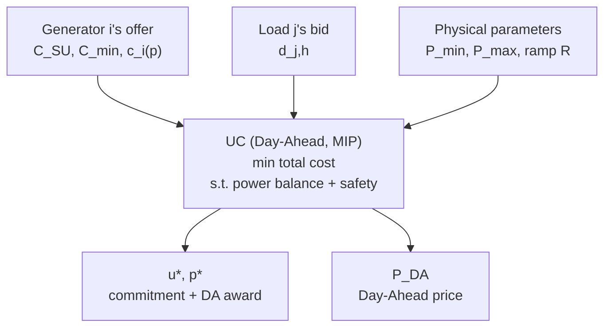
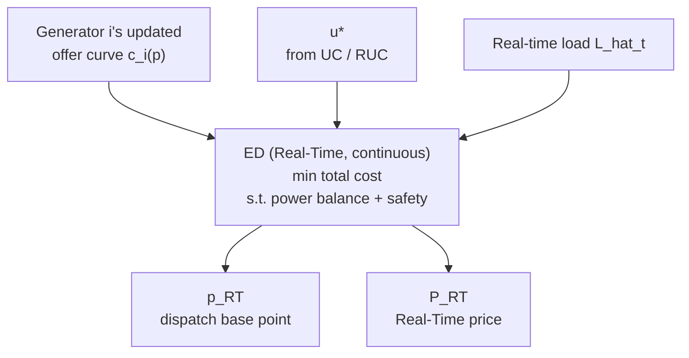

Electricity markets are a genuinely interesting kind of market. Unlike most commodity markets, they have two distinctive features:

<!--more-->

1. **Real-time supply-demand balance**: electricity can't be stored cheaply at scale, and it has to move through the transmission network in real time. If supply and demand mismatch at any single moment, system frequency and voltage go out of tolerance, and in severe cases this cascades into widespread blackouts — so the system has to maintain supply-demand balance at **every instant**.
2. **Randomness on both sides, and supply that can't respond instantly**: on the supply side, bulk generation (coal plants across China, gas plants across the US) is slow and expensive to start — a unit can take hours to go from cold start to stable output, and every start/stop carries a real cost. Wind and solar, meanwhile, have essentially no startup cost, but their output depends heavily on weather and carries a lot of uncertainty. Demand is random too — neither large commercial load nor residential load can be forecast precisely (none of us plans in advance exactly when we'll flip a light switch).

Together, these two features gave rise to electricity markets' distinctive two-tier structure: the **Day-Ahead (DA)** market and the **Real-Time (RT)** market. And it's precisely because this structure creates a "forecast → correction" time gap that **virtual trading** — a mechanism rarely seen in other commodity markets — emerged on top of it. This note follows that logic through, step by step.

---

## 1. Who Manages and Participates in the Market?

In the US, wholesale electricity markets are generally run by an **ISO (Independent System Operator)** or **RTO (Regional Transmission Organization)** — non-profit entities independent of generators and utilities, responsible for keeping the grid safe and reliable while operating the DA and RT markets to clear economic dispatch. The major US ISOs/RTOs include PJM, MISO, CAISO, ISO-NE, NYISO, SPP, and — the one this note uses as its running example — **ERCOT (Electric Reliability Council of Texas)**, which manages roughly 90% of the Texas grid.

ERCOT's website: [https://www.ercot.com](https://www.ercot.com) — it publishes DAM/RTM market data and rules documents, and is a good primary source for verifying details like these.

### The players in the market

At a coarse level, there are roughly three types of participants: **generation**, **load**, and **virtual traders**. What generation and load actually do is covered in Sections 2 and 3; virtual traders get their own detailed treatment in Section 5, "What is Virtual Trading." One thing worth flagging here up front: **not every ISO permits virtual traders** as a purely financial category of participant — Section 5 spells this out, and it matters a lot specifically in ERCOT's case. Generation and load, on the other hand, play essentially the same role across almost every ISO.

---

## 2. What Are the Day-Ahead and Real-Time Markets? (Intuition)

As mentioned above, electricity moves through the transmission network, and the system's safe operation depends on supply-demand balance at every instant. To see why this requires two separate markets, start with the characteristics of supply and demand:

**Supply side** consists of two broad categories:
- **Bulk generation**: conventional large units (coal, gas, nuclear), slow and expensive to start, requiring advance planning.
- **Wind/solar**: near-zero marginal cost, but highly variable output, heavily dependent on weather forecast accuracy.

**Demand side** is mostly large commercial and residential load, both random — nobody plans precisely when they'll turn on a given light.

Consider a single day, call it $D$. Then $D\text{-}1$ is the day before $D$.

**Bulk generation's slow-start nature** directly motivates a **DA market**: this market runs on $D\text{-}1$, and its purpose is to roughly determine, a day ahead, the generation mix for every hour of $D$ — i.e., to answer "should this unit be committed during this hour?" Intuitively, this is solving the problem: "given a forecast of tomorrow's load and renewable output, how should units be turned on/off and dispatched to minimize total cost while respecting every safety constraint?" This is known in the industry as **Unit Commitment (UC)**, fundamentally a mixed-integer program (because "on/off" is a 0/1 decision). The DA market's clearing result lays the groundwork for the whole system's supply-demand balance, ensuring the system can roughly meet its basic balance once it's actually operating — rather than being caught completely unprepared. The exact mathematical form of UC is deferred to Section 3's Deep Dive, where we build it up alongside what generation and load actually submit.

### But DA is only a "forecast"

DA dispatch is fundamentally a decision made against a **forecast** of the next day (forecasted load, forecasted renewable output), and any forecast carries error. That error can't be resolved on $D\text{-}1$ — it can only be corrected in real time, on day $D$ itself, by the **Real-Time Market (RTM)**. RTM runs continuously throughout $D$ (the exact granularity varies by market — ERCOT, for instance, runs economic dispatch every 5 minutes and settles every 15 minutes).

Intuitively, RTM solves an **Economic Dispatch (ED)** problem: given the units UC has already decided to commit, redistribute their output at every moment to meet actual load at minimum cost, without violating any safety constraint. Unlike UC, there's no "on/off" integer decision here anymore — whether a unit is online has already been mostly settled at the UC (and possibly subsequent reliability-commitment) stage. ED's exact mathematical form is also deferred to Section 3.

---

## 3. Day-Ahead and RT Market Deep Dive

The section above explains the overall logic; this section fills in the details: what generation and load actually submit in DAM and RTM, how those submissions become the inputs to UC and ED, and what the two programs left open in the previous section actually look like. (Virtual traders were already introduced in Section 1; their behavior is covered in Section 5. This section looks at things from the generation and load side.)

### What does generation submit in DAM?

Building on the UC intuition from Section 2, what generator $i$ submits is collectively known in the industry as an **offer** — this is the so-called **three-part offer**, consisting of three pieces:

- $C_i^{SU}$: startup offer ($/start)
- $C_i^{min}$: minimum-energy offer (the price at output level $\underline{P}_i$)
- $c_i(p)$: energy offer curve, a piecewise-linear curve of $p$ vs. $\$/MWh$

These three pieces are the actual source of the $C_i^{SU}, C_i^{min}, c_i(\cdot)$ terms that appear in the UC objective function below — they aren't set by the ISO out of thin air; the generator reports them itself.

### What does load submit in DAM?

Correspondingly, what load $j$ (or more precisely, the LSE representing it, via a QSE) submits is collectively known as a **bid**: a **demand bid curve** $v_j(d)$ — how much it's willing to pay for the $d$-th MW — playing a role symmetric to the generator's offer curve. If load is close to fully inelastic (as much retail load in practice is), this curve collapses to a fixed quantity $d_{j,h}$ (bid close to the price cap, ensuring it almost always clears). Total system load is then $L_h=\sum_j d_{j,h}$ — the actual source of $L_h$ in UC.

### UC: turning offers and bids into awards and prices



Now we can write out the UC left open in Section 2 in full:

$$
\min_{u_{i,h},\, p_{i,h},\, y_{i,h}} \quad \sum_{i,h} \Big[\, C_i^{SU}\cdot y_{i,h} \;+\; C_i^{min}\cdot u_{i,h} \;+\; c_i(p_{i,h}) \,\Big]
$$

$$
\text{s.t.} \quad \mathbf{1}^\top p_h = L_h \qquad \text{(power balance, for each } h\text{)}
$$

$$
\underline{P}_i\, u_{i,h} \le p_{i,h} \le \overline{P}_i\, u_{i,h}, \qquad |p_{i,h}-p_{i,h-1}|\le R_i \qquad \text{(safety / physical constraints)}
$$

$$
y_{i,h} \ge u_{i,h}-u_{i,h-1}, \qquad y_{i,h}\ge0 \qquad \text{(startup indicator)}
$$

where:
- $u_{i,h}\in\{0,1\}$: whether generator $i$ is committed during hour $h$ — this is the "integer" variable that makes UC a MIP in the first place;
- $p_{i,h}\ge0$: generator $i$'s actual output during hour $h$;
- $y_{i,h}$: whether generator $i$ underwent a "startup" (off to on) during hour $h$. It doesn't need to be explicitly declared as an integer — because $C_i^{SU}>0$ and the objective is minimization, the solver naturally pushes $y_{i,h}$ down to exactly $\max(0,\,u_{i,h}-u_{i,h-1})$, since paying extra startup cost for no reason would never be optimal;
- $C_i^{SU},\,C_i^{min},\,c_i(\cdot)$: from the generator's offer;
- $\underline{P}_i,\overline{P}_i$: the unit's physical output limits, $R_i$: ramp-rate limit;
- $L_h=\sum_j d_{j,h}$: the sum of load's bids.

Solving this MIP gives you $u^*_{i,h}$ — which units should be online — and $p^*_{i,h}$ — the **award** each unit receives in DAM. The shadow price (dual variable) of the power-balance constraint, $\lambda_h$, is the **DA price** $P^{DA}_h$ for that hour.

Worth emphasizing: the UC program itself has no idea what any generator's true generation cost is, nor what any load's true consumption is worth — it's simply solving an optimization problem over the numbers $C_i^{SU}, C_i^{min}, c_i(\cdot), v_j(d)$ that participants themselves reported. This is exactly why **truthful bidding** matters so much in this kind of market design: if a participant misreports its offer/bid, the UC solution is no longer the true-cost-optimal / true-value-optimal outcome.

### What do generation and load each do in RTM?

- **Generation**: before each SCED solve, it can **update** its energy offer curve $c_i(p)$ (it doesn't have to match what was submitted in DA), and then **follows** the dispatch base point $p_{i,t}^{RT}$ that ERCOT issues every 5 minutes.
- **Load**: most load submits nothing at all in RTM — it passively consumes whatever it consumes, and actual consumption $d_{j,t}^{RT}$ is *observed*, not *decided*. (Only special, controllable large loads — Load Resources / Controllable Load Resources — can actively submit bids and receive dispatch instructions in RTM the way a generator does.)

### ED: reallocating offers in real time



Likewise, here's the ED left open in Section 2, written out in full:

$$
\min_{p_{i,t}} \quad \sum_i c_i(p_{i,t})
$$

$$
\text{s.t.} \quad \mathbf{1}^\top p_t = \hat{L}_t \ \text{(real-time load)}, \qquad \underline{P}_i\, u^*_{i,h} \le p_{i,t} \le \overline{P}_i\, u^*_{i,h}, \qquad |p_{i,t}-p_{i,t-\Delta}|\le R_i\Delta
$$

Here, $c_i(p)$ is the generator's **updated** offer curve in real time (which can differ from what was submitted in DA), $u^*_{i,h}$ is the on/off status already decided by UC (and possibly reliability commitment), and $\hat{L}_t$ is the real-time load at that instant. Just like UC, the ED program has no idea about anyone's true cost either — $c_i(p)$ is still a number the generator itself reports, just one that can now be updated every 5 minutes.

Each solve produces a fresh set of $p^{RT}_{i,t}$ — the dispatch instruction (or "base point") each unit receives — along with the corresponding dual price: the **RT price** $P^{RT}_t$.

### A concrete example

Suppose in some hour $h$, generator A clears a DAM award of $p^*_A=100$ MW at $P^{DA}_h=\$30$/MWh. In real time, for some reason (say, congestion, or a forced backdown), it actually only produces $p^{RT}_A=80$ MW, and $P^{RT}_h=\$50$/MWh at that time. Two-settlement:

$$
\text{Payment}_A = \underbrace{100\times30}_{DA} + \underbrace{(80-100)\times50}_{RT\ \text{deviation}} = 3000-1000=\$2000
$$

In the same hour, suppose load B bought $d^*_B=100$ MW in DAM at $P^{DA}_h=\$30$/MWh, but actually consumed $d^{RT}_B=110$ MW (say, an unexpectedly hot afternoon):

$$
\text{Cost}_B = 100\times30+(110-100)\times50=3000+500=\$3500
$$

Both sides settle by the exact same logic: the DA portion is locked in, and the RT portion simply settles the gap between the DA-committed quantity and the actual quantity, at the RT price.

---

## 4. Motivation: Uncertainty is Bad but Also Opportunity

That example already shows the problem.

**Generator A** was forced to underproduce, and happened to run into a rising RT price, losing an extra **\$1000** (relative to the benchmark of "deliver exactly 100 MW, collect a flat \$3000"). **Load B**'s situation runs the opposite direction but follows the same logic: it consumed more than forecast, and happened to run into a rising RT price, paying an extra **\$500** (relative to the benchmark of "consume exactly 100 MW").

But this "loss" depends entirely on which way the luck breaks. Flip it around:

- If generator A had instead been instructed to produce *more* — say 120 MW instead of being cut to 80 — with the same $P^{RT}_h=\$50$, its deviation term becomes $(120-100)\times50=+\$1000$: the same underlying uncertainty about "deviating from the DA award" turns into a windfall instead.
- If load B had actually consumed only 90 MW that day (instead of 110), with the same $P^{RT}_h=\$50$, its deviation term becomes $(90-100)\times50=-\$500$ — meaning it pays \$500 *less*, effectively "selling back" the 10 MW it didn't use at \$50 in real time.

In other words:

> **Uncertainty is inherently two-sided — it can produce a loss or an unexpected gain, and which one happens depends entirely on how the sign of the deviation and the direction of the RT price happen to combine — both of which are unknown at the moment a DA position is submitted on $D\text{-}1$.**

The trouble is, a generator's core business is generating power, and a load's core business is consuming power / serving its own customers — neither wants to passively bear this financial swing that arises purely from forecast error, in a direction neither can control. It's a risk they're forced to carry but aren't well-suited to manage.

But flip the framing once more: since this DA-RT spread is fundamentally a **forecasting problem** about future prices, there ought to exist a third party specialized in forecasting, willing to actively take on this risk in exchange for expected return. This is exactly the intuition behind the **virtual trader** — someone who owns no physical asset at all, focuses purely on forecasting the DA-RT spread, and takes a purely financial position betting on it. In effect, this transfers the risk that generation and load don't want (and aren't good at managing) to a participant whose entire purpose is bearing it.

---

## 5. What is Virtual Trading

**One clarification first**: not every ISO permits the purely financial virtual trading described below. NYISO, ISO-NE, PJM, MISO, and CAISO all allow it — but **ERCOT currently does not**. Per Hubert, Lolas & Sircar (2026), ERCOT has no INC/DEC-style purely financial energy virtual trading; physical resources bear DART-like exposure themselves through their own decision of whether to self-commit in the DAM, but there's no separate, asset-free "purely financial trader" role that can directly place INC/DEC positions. What ERCOT does have is the **PTP Obligation** — a financial product that only bets on the congestion spread between two nodes, rather than the absolute spread at a single node — logically a subset of what INC/DEC cover in Section 6 (it captures only the congestion component).

The discussion below still uses INC/DEC terminology to explain the core logic of virtual trading — this mechanism genuinely exists in markets like NYISO, ISO-NE, and PJM, and understanding it makes it much clearer, when you come back to ERCOT's PTP Obligation (or the "generator decides whether to self-commit" point from Section 3), what the underlying design tradeoff actually is.

A virtual trader's participation is remarkably clean — it submits a position only in **DAM**, and never appears in **RTM** at all:

- **INC** (functionally a financial seller): "sells" $x^{INC}_h$ MW in DAM;
- **DEC** (functionally a financial buyer): "buys" $x^{DEC}_h$ MW in DAM.

Both enter **exactly the same** power-balance constraint as generation and load:

$$
\sum_i p_{i,h} + x^{INC}_h = \sum_j d_{j,h} + x^{DEC}_h
$$

The UC optimization makes no distinction between "real" and "purely financial" supply/demand — which is exactly why it slots into the Section 3 UC framework seamlessly, with no extra modeling needed.

Settlement is equally simple, since there's never any physical delivery involved:

$$
\text{INC profit} = (P^{DA}-P^{RT})\times Q, \qquad \text{DEC profit} = (P^{RT}-P^{DA})\times Q
$$

The trader's entire "action" consists of submitting a single position during the DAM bidding window on $D\text{-}1$. Once DAM clears, the economic outcome is fully locked in — all that's left is waiting for the RT price to realize.

---

## 6. Benefits of Virtual Trading, Revisited

Back to generator A and load B from Section 4 — virtual trading directly addresses both of these specific losses, but through two different **channels**: one operates at the **system level** (someone else trades, the DA price at that node shifts, and you benefit passively), the other at the **individual level** (you yourself hold a virtual position to hedge your own risk). Below, each is illustrated by revisiting the corresponding Section 4 example. (Reminder: these two examples use the logic of markets like NYISO/ISO-NE/PJM that permit virtual trading — see the Section 5 clarification.)

### Addressing generator A's loss (system level)

Suppose this node has historically shown a pattern where "DA tends to be underpriced, RT tends to run high" — say, because forecasters systematically underweight how often a nearby wind farm underperforms in the evening. Traders who've studied this pattern judge that $P^{RT}>P^{DA}$ is more likely than not, and submit **DECs**, buying in DAM. This extra demand pushes $P^{DA}_h$ up from \$30 to, say, \$40 (simplifying here by assuming the award quantity stays fixed and only the clearing price rises).

Now, even though generator A still only produces 80 MW (still forced into the same backdown), its settlement becomes:

$$
100\times40+(80-100)\times50=4000-1000=\$3000
$$

— exactly back to what it would have earned by delivering 100 MW precisely. The presence of virtual traders pulled forward, into the DA price, some of the scarcity value that would otherwise only have shown up in real time — indirectly making up generator A's \$1000 loss. And notably, generator A **didn't have to do anything** — the price signal simply got better.

**There's a second-order effect here worth spelling out.** DEC buying adds to the demand side of the DAM power-balance constraint — for the market to clear, that extra "demand" has to be matched by some change on the supply side, and mechanically there are two possibilities:

1. **Intensive margin**: already-cleared units get bigger awards (they were producing anyway, they just sell more of it forward);
2. **Extensive margin**: the higher clearing price crosses some unit's offer threshold, and a unit that wouldn't otherwise have cleared gets newly committed — $u_{i,h}$ flips from 0 to 1.

Only the second case actually brings new physical capacity online. This is the same mechanism as the coal-plant example from Section 3's Deep Dive (DA rising from \$30 to \$65 caused a \$50-marginal-cost unit to newly clear) — if what's happening here is an extensive-margin effect, that newly committed unit is also online and dispatchable in real time, and $u^*_{i,h}$ is exactly the initial commitment state UC hands off to RTM (the physical link we discussed in Section 3). One more online unit in the system means the probability and severity of an actual real-time scarcity event both go down — and scarcity is the main driver of extreme RT price spikes.

Two things worth being precise about, though:

- **This only holds at the extensive margin.** If the extra demand just gives already-online units bigger awards without committing any new unit, "scarcity gets relieved" doesn't apply.
- **This isn't quite the same as "load gets cheaper electricity."** Notice load's DA-hedged cost in this example actually *rises* (from \$30/MWh to \$40/MWh — that's the whole point). What's really happening: DA price had been systematically underpricing the true underlying risk (the wind-underperformance pattern), so capacity that should have been committed through the cheap, efficient DAM channel wasn't — and that cost was always going to get paid eventually, just through a more expensive, less efficient channel instead (RUC's out-of-market commitment, or RT scarcity pricing — both of which ultimately get charged back to load as uplift anyway). So the more defensible framing is: **not "cheaper," but "less exposed to tail-risk price spikes, with the unavoidable cost now paid through the cheaper channel instead."** This is the same logic behind the Potomac Economics MISO finding cited in Section 6 — virtual trading lets the market reflect the expected value of real-time uncertainty ahead of time, rather than waiting for the expensive RUC/scarcity-pricing machinery to kick in.

### Addressing load B's loss (individual level)

Conversely, if load B (or its LSE) had itself anticipated that its forecast might be running low — say, knowing a heat wave was coming — it could **actively play the role of a virtual trader itself**: in addition to buying 100 MW of forecasted physical load, it also buys a 10 MW **DEC** position, specifically betting that "real time will likely come in more expensive than forecast."

If things play out exactly as in Section 4 — 110 MW actually consumed, $P^{RT}=\$50$:

$$
\text{Physical portion (unchanged):}\ 100\times30+(110-100)\times50=3500
$$
$$
\text{DEC position profit:}\ (50-30)\times10=\$200
$$
$$
\text{Net cost:}\ 3500-200=\$3300
$$

Interestingly, \$3300 is exactly equal to $110\times30$ — meaning that as long as load B sizes its DEC position precisely to match its true realized deviation, its final net cost becomes exactly equivalent to "settling its entire actual 110 MW consumption at the DA price." It's converted the direction-uncertain deviation risk from Section 4 into a fixed, DA-priced bill. Of course, this only works if load B correctly anticipates how large its own deviation will be — get that sizing wrong, and the hedge is only partial, leaving some residual exposure.

### Summary

Both examples make the core value of virtual trading clear: it converts the "forecast-error risk" that generation and load in Section 4 were forced to bear — but couldn't manage well — into a financial position that can be priced, traded, and hedged. A third party willing to bear that risk, and better equipped to forecast it, takes the other side of the spread. This helps everyone through an improved **system-level** price signal (DA price becomes a closer match to the true expected RT price), and it also gives generation and load an **individual-level** hedging tool — letting them, when they choose to participate directly, precisely transfer out the specific piece of risk they're exposed to.

---

## 7. Further Reading

**Hubert, E., Lolas, D., & Sircar, R. (2026). "Trading Electrons: Predicting DART Spread Spikes in ISO Electricity Markets." arXiv:2601.05085.**

This paper focuses on forecasting extreme DART spread events (spikes) and turning predictive signals into executable INC/DEC positions — using exactly the INC/DEC framework from Sections 5–6, but adding two things this note doesn't go into: (1) a **price-impact model** built from day-ahead bid stacks — since a trade that's too large moves the DA price against itself, and the paper derives closed-form optimal position sizes, directly connecting to the implicit "an oversized position can eat its own edge" point at the end of Section 6; (2) an empirical comparison across NYISO, ISO-NE, and ERCOT — and it's this paper's own clarification that **ERCOT does not permit virtual trading**, which is where the Section 5 caveat in this note comes from.

**Xie, L., Huang, T., Kumar, P. R., Thatte, A. A., & Mitter, S. K. (2022). "On an Information and Control Architecture for Future Electric Energy Systems." Proceedings of the IEEE, 110(12), 1940–1962.**

This article situates UC and ED inside a much bigger picture — the grid runs on a whole stack of "control loops" spanning timescales from millisecond-level protective relaying, to minute-level ED, to hour-level UC, all the way to year-level infrastructure planning. If you want to understand what else an ISO manages beyond DAM/RTM (the relationships among GENCOs, DISCOs, TRANCOs, and aggregators), and what's changing with VPPs and DER aggregation (FERC Order 2222), this is a good entry point.

---

*The math in this note is a simplified version, meant to illustrate the core logic. ERCOT's actual SCUC/SCED includes additional mechanisms — network/congestion constraints, ancillary-service co-optimization, RUC, and more. The Section 5 note on ERCOT not permitting virtual trading draws on Hubert et al. (2026); verify remaining details against ERCOT's current Nodal Protocols ([ercot.com](https://www.ercot.com)) before publishing anything based on this. The Mermaid flowcharts in this note require a renderer that supports ```mermaid code fences to display properly.*
